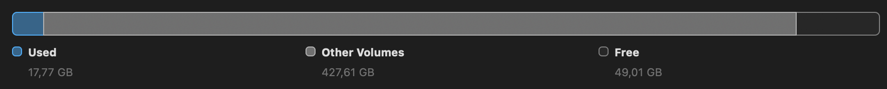
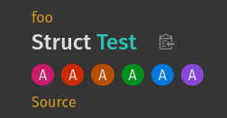

+++
title = "Rustdoc: F*** it I'm helping."
description = "Who else?"
date = 2026-08-23T19:33:19+00:00
updated = 2026-08-28T12:00:00+00:00
draft = false
template = "blog/page.html"

[extra]
lead = "Afraid of contributing to a programming language? Don't be!"
+++

Because we usually think about writing something once it's done, articles depicting the actual experience from a new contributor are rather rare, this document is written as a journal, as I get through my contribution.

# Finding something

I'm helping, but what?

Well well well... look at who wrote something actionable !? Let's look at [making important traits more discoverable](@/blog/rustdoc_notable_trait/index.md).


To be clear, that article merely put together the hard work of a handful of motivated individuals! It's not rocket science, just patient listening, or... reading.

If you have something that bothers you, do your research, and gather important resources: details get lost in cross references so it's helpful to have a smaller document listing a few points of entry to the topic, and restate the need... and keep the scope manageable.

Listening to Waffle's talk about `Never` probably reminded me that, go watch [its talk](https://www.youtube.com/watch?v=3jM4cnEVrLc).

# Discovering

Honestly, <https://rustc-dev-guide.rust-lang.org/> is well written!

With links at the top of each pages to orient you to laser-focused user objectives, you quickly get to the point where your developer environment is ready to go.

I've been told that build times would be long, brace yourselves...

*When we're more familiar with the beast, we'll help make it faster!*

# Get the sh** done

Got some disk space to spare?

Count 20 Go to build on rustc, honestly, not too bad, do a `cargo clean` on any other rust project and you'll be fine 🧌.



`git clone blabla` -> `./x build` -> *go* **brr** -> it works!

Wow! So easy that now you have no excuses, embarrassing!

`./x test`

```txt
failures:
    [ui] tests/ui/allocator/regression-abort-on-free-issue-150898.rs
```

Turns out this one's on me! brb upgrading my machine... Nice touch to leave breadcrumbs in the code 👍.

> // The bug was resolved by macOS 26.4.

[source](https://github.com/rust-lang/rust/blob/54333ff079780f803f65dcee30c544050b35f544/tests/ui/allocator/regression-abort-on-free-issue-150898.rs#L12)


## Actually get the sh** done.

A small fairy (i.e. an enthusiastic Guillaume Gomez) pointed me towards `rustc_attr_parsing`:

🧚
> That's where the magic happens... 💨

<details>
<summary><b>Don't click me</b> If you have any PTSD from software development time estimation.</summary>

😱

Let's take a note on what day we are now: **23 May 2026**.

If you are an experienced software engineer like me, you probably have a well defined process to estimate accurately how much time such a project will take.

I suggest we both do the calculation and compare at the end, you'll tell me if "The result will surprise YOU!©️"

Let's get into software duration estimation (or voodoo, whatever)

### Split in rough tasks

- add an attribute to be parsed (the `rustc_attr_parsing` 🧚)
- make examples
- verify it's parsed correctly
- fix bugs
- is there tests at that point? or later?
- read that attribute in render
    - find out where exactly 😅
- update the rendering
- discover more test suite using some obscure *(for now! the fairy told it was approachable 🤞)* custom accessibility API I'll have to learn
- yak shave naming and realize you needed a RFC before doing this work
  - restart with the RFC, bikeshed it and wait some more.
- Resolve code conflicts

That + some *surprise buffer*™️... **6 months.** Obviously.

Did you get the same number? Let's see if that was correct !?

> If you're not an "experienced software engineer", this (too long) section anchored in reality borders a joke about estimations being requested even when the context doesn't allow us to come up with a committable answer:
>
>  Here I'm joining just now and have no idea how the project works, nor whether I'll have any availability to work on it whatsoever.

</details>

### Get to it already...

What exactly? Our objective is to introduce a `#[doc(label_trait)]` attribute to traits we want to display a badge on.

## #[...]

When looking in the code, I stumble on `hir::AttributeKind`, but that's not what we want, that one is for top level [attributes](https://doc.rust-lang.org/reference/attributes.html).

Our change is specific to rustdoc, so we want to find [**doc** attributes](https://doc.rust-lang.org/rustdoc/write-documentation/the-doc-attribute.html#at-the-item-level).

## #[doc(...)]

By searching for something we know is a **doc** attribute (but specific: e.g. `html_favicon_url`), we'll quickly find 
`rustc_attr_parsing::context::ATTRIBUTE_PARSERS`.

a.k.a: a "big ass list".

DocParser feeds a Symbol (some index) through `parse_single_doc_attr_item` ; for example `sym::alias`

⚠️ no clue how each `sym::value` are generated, rust analyzer refuses to go to definition, it's probably through some macro, and `rustc_hir::attrs::DocAttribute` seems involved.
Let's try something simple, a simple "word", to know if the trait should be "labeled". We'll add the color later. We can look into the implementation of "hidden" `#[doc(hidden)]`.

```rs
Some(sym::label_trait) => no_args!(label_trait),
```

Cool, I'm done!

```
error[E0531]: cannot find unit struct, unit variant or constant `label_trait` in module `sym`
   --> compiler/rustc_attr_parsing/src/attributes/doc.rs:506:23
    |
506 |             Some(sym::label_trait) => no_args!(label_trait),
    |                       ^^^^^^^^^^^ not found in `sym`

error[E0609]: no field `label_trait` on type `DocAttribute`
   --> compiler/rustc_attr_parsing/src/attributes/doc.rs:506:48
    |
441 |                 self.attribute.$ident = Some(path.span());
    |                                ------ due to this macro variable
...
506 |             Some(sym::label_trait) => no_args!(label_trait),
    |                                                ^^^^^^^^^^^ unknown field
    |
    = note: available fields are: `first_span`, `aliases`, `hidden`, `inline`, `cfg` ... and 17 others
```

Sure.

Ok `DocAttribute` is straightforward! The other is about the symbol, nice, breadcrumbs to follow!

Oh. Now THAT's a big ass struct. `compiler::rustc_span::symbol` has more than 2000 values! No wonder rust analyzer struggles with parsing that.

> // There is currently no checking that all symbols are used; that would be nice to have.

-- Nicholas Nethercote, when the list was ~1000 symbols, [in 2020](https://github.com/rust-lang/rust/commit/fd8f1772347d122b223ef573aeaa34cfa93ceec5).

```rs
ferris: "🦀",
```

---

Back to our horse.

I'm tempted to add `label_trait` in there, but I notice there is also `doc_notable_trait`, I'll probably have to add a `doc_label_trait`. We'll see.

We follow the compiler who tells us where to update things now.

We'll probably tag our attribute unstable, I imagine that's a fair strategy, to let it cook.

```rs
declare_features! (
(unstable, doc_notable_trait, "1.52.0", Some(45040)),
)
```

What's that number for ? An issue, sure. BRB writing an RFC!

Actually "RFC" is a bigger process than a simple issue, and we can open a simpler tracking issue aimed at libraries (rustdoc is), and the process is less ceremonial.

Here you go: <https://github.com/rust-lang/rust/issues/156865>.

Oh and when you modify something, look at its doc, it's full of "if you modify this, modify that.", neat.

```rs
// If you change this, please modify `src/doc/unstable-book` as well.
```

~~That's another repository!~~ *I thought so, but it actually isn't*.

<!-- TODO: do unstable book update there, I'm on a train, I can't now. -->

### Feedback loop

Following the breadcrumbs of compilation and searching for similar items, I ended up making a "ui" test, we'll have to make sure the unstable feature is correctly set up, and then we'll add tests for applying our attribute to traits, negative traits, generics, and error cases. The html tests will come after.

I can run `./x test ui --test-args label_trait` to avoid running all 20_000+ ui tests! The documentation mentions  `tests/ui` rather than `ui`, but both work, should it be updated?

### Dev experience

Rust-analyzer has some bindings for `notable_trait`. Of course, IDE integration!

It's neat to have everything in 1 repository: it helps understanding all the implications of 1 feature. Let's stay focused on our intended feature for now, but keep this in mind (in tracking issue) for a follow up PR, maybe YOU will want to implement it?

Seeking of "developer experience", I have that message:

```
WARNING: you have not made a `bootstrap.toml`
HELP: consider running `./x.py setup` or copying `bootstrap.example.toml` by running `cp bootstrap.example.toml bootstrap.toml`
```

Wasn't `./x.py` deprecated in favor of `./x`? That may be an easy PR!

OK run that `./x setup`:

```
Welcome to the Rust project! What do you want to do with x.py?
a) library: Contribute to the standard library
b) compiler: Contribute to the compiler itself
c) tools: Contribute to tools which depend on the compiler, but do not modify it directly (e.g. rustdoc, clippy, miri)
d) dist: Install Rust from source
e) none: Do not modify `bootstrap.toml`
```

Eh, I really want to change something on rustdoc, but... also add an attribute, so I think we're on **b**. It makes me wonder if I chose the correct issue template earlier, I'm not modifying the standard library, but internal rustc libraries 🤔...

The setup script installs some vscode settings, I didn't notice particularly bad experience other than some go to definition broken which I blamed macros for, we'll see if that's better.

### Continuing...

Where were we? We added the attribute in a bunch of places, now let's try to use it!

## Rendering

rustc gives HIR, `librustdoc/clean/` makes `clean::Item`s, `librustdoc/html/render/` makes pages. Templates are [askama](https://github.com/askama-rs/askama), so the struct and the HTML have to agree or it doesn't compile, yay to compile time errors!

"All traits this type implements" lives in `cx.cache().impls`. Filter to positive impls (`impl !Send for Foo` gets no badge 😅), keep the ones with our attribute, done.

But! `Box<T>` implements `Iterator` when `T` does, and `Pin` does the same for `Future`. So naturally, every `Box` in the docs proudly earns an `Iterator` badge...

There's already a logic for that: the existing notable-traits popup skips both, a few lines up in the same file. I copy-paste the logic for now (spoiler, I eventually extracted it in a shared function).

Not a fan of hardcoded exceptions, but hey, we gotta move on.

# XPath

I had been warned about some "obscure accessibility API"... `htmldocck`: XPath in comments

```rs
//@ has 'foo/struct.Tagged.html'
//@ has - '//div[@class="label-trait-badge-container"]/a[1]' 'AlsoLabeled'
//@ has - '//div[@class="label-trait-badge-container"]/a[2]' 'Labeled'
pub struct Tagged;

//@ count - '//div[@class="label-trait-badge-container"]' 0
pub struct Untagged;
```

Actually, quite readable! It even comes with nice documentation: <https://rustc-dev-guide.rust-lang.org/rustdoc-internals/rustdoc-html-test-suite.html>.

# Open the PR.

**28 May 2026**: <https://github.com/rust-lang/rust/pull/157058>.

It's not ready, but that's the point!

```
Some changes occurred in compiler/rustc_attr_parsing
cc @jdonszelmann, @JonathanBrouwer
Some changes occurred in HTML/CSS/JS.
cc @GuillaumeGomez, @lolbinarycat
rust-analyzer is developed in its own repository...
r? @fmease
```

Woops, did I disturb the whole world? Nevermind,
let's be clear about the status of this PR, that's still in progress.

I like to open preliminary PRs to signal someone else that I'm working on it,
sometimes it ends up in joint effort, and it lowers the risk of duplicated effort.

It also told me my rust-analyzer changes belong elsewhere. Veykril confirmed, thanks! Got it removed.

## Review your own PR

I love to comment my own code, it helps with communicating my doubts or specific choices I made. Sometimes I even spot problems and solutions!

> this will need a stabilization pr, not sure how to tackle that (and which version should be there).

Especially in the time of *vibe coding*, owning uncertainty it tremendously important.

## CI is red!

`tidy` failed in 7 minutes. Not the compiler. Not the tests. **Formatting.**

On a file I didn't touch...

> I'll disable my formatting 💯

I run `./x test tidy` before pushing. And `.stderr` files aren't hand-edited: `./x test tests/ui --bless`.

# Reviews coming in

rustbot rolled `@fmease`. `@GuillaumeGomez` reviewed. 🧚

> You're supposed to write `CURRENT_RUSTC_VERSION` instead of `1.97.0`. It'll be replaced on next release. But good point. ;)

That's a reason I like to open PRs early, I didn't find the correct way of handling that, and it's an easy information for experienced reviewers to give!

> I would generate the color hash from the trait path (so `crate::Trait`). Like that it will be stable across releases.

I had hashed the `DefId`, and flagged that I wasn't sure it was stable. Turns out `DefId`s can (will) change between compiler versions, so a badge would change color every six weeks... Changed to Hash `foo::Labeled` instead.

Then a comment to use a `BTreeMap` in place of a `Vec`, fine.

## Uncertainty

There's a `doc-notable-trait.md` in the unstable book, let's add a `doc-label-trait.md` too!

I got shut down:
> Should not be here, only in rustdoc book considering it's a rustdoc attribute.

Meh, why is there that `doc-notable-trait.md` then? Whatever, I'll oblige, but still comment on my surprise, I may be missing information, or reviewer is, either way we both learn!

> are you sure about your feedback? - or should we clean up other doc attributes that shouldn't be here (in other pr)?

No answer will be given on that one, forgotten in the github depths. If you know better, let me know somehow!

# Only fools don't change their opinions

I knew there was some rustdoc meetings occasionally, so doing my research:
- internal doc: <https://forge.rust-lang.org/rustdoc/meetings.html>
- source information: <https://github.com/rust-lang/calendar/blob/main/rustdoc.toml>
- then I install zulip and learn yet another communication mean.
- share I want to talk about my PR

Let's attend the [rustdoc meeting](https://hackmd.io/CxdTcVFTQPmBUrx-PWXTAw?view)!

When we need some design/architecture/API decision, it's highly effective to talk to people, get the needle moving right!?

Skip to the decision: No new `label_trait` feature, reuse `notable_trait`.

Ah... [called it!](../rustdoc-notable-trait/)

Nevermind, I agree with the decision, it's always great to remove (or not introduce) some code, and I learnt a bunch of interesting stuff along the way.

Behold "label trait feature now part of notable traits features":

```txt
compiler/rustc_ast_passes/src/feature_gate.rs        +0/-1
compiler/rustc_attr_parsing/src/attributes/doc.rs    +0/-2
compiler/rustc_feature/src/unstable.rs               +0/-2
compiler/rustc_hir/src/attrs/data_structures.rs      +0/-3
compiler/rustc_middle/src/queries.rs                 +0/-5
compiler/rustc_middle/src/ty/util.rs                 +0/-6
compiler/rustc_passes/src/check_attr.rs              +0/-2
compiler/rustc_span/src/symbol.rs                    +0/-2
tests/ui/feature-gates/feature-gate-doc_label_trait.rs      removed
tests/ui/feature-gates/feature-gate-doc_label_trait.stderr  removed
```

# Bikeshedding

Which color will our bikeshed (badge) be? I'm aware of accessibility, eye vision conditions, constrast, and multiple themes, so the chosen colors have to respect a fair share of constraints, as well as fit subjective taste of reviewers, I'll do my best guess and post some screenshots. Check them on [the PR](https://github.com/rust-lang/rust/pull/157058).

> that's very bikeshedding so I'll defer to authority.

## href to source

On the badge, we should be able to follow it to get to its documentation. On my self review, I was wondering if this href should be an option...

Guillaume, May:

> I think we should always link to the trait

[Guillaume, June](https://github.com/rust-lang/rust/pull/157058#discussion_r3491542706):

> Should be `Option<String>` to correctly handle not linkable items.

😌

After some investigation, href can be `None` when building docs with `--no-deps` option. Let's model that and move on.


# Waiting...

Some rebasing every now and then to keep it up to date, my reviewer is a bit busy, so I let it rot a bit for a month, the PR is quite small and I don't expect much churn in that area so I'm hopeful there won't be much conflicts.

And then he drops me a message, he got some time! Let's rebase one last time, and hand over.

# The last mile.

**28 July.** Two commits appear on my branch that I didn't write: `Make notable badge colors theme-dependant`, `Make notable trait badge tests a bit "stronger"`.

> The text color is the same as the main one, so I changed the badges color a bit to match with it.
>
> I don't think we'll allow to set any color we want (because of theme things), only one between the 6 we provide. If it's fine with you, let's do that in a follow-up.

Nice, I get to review some code too! LGTM.

> Thanks a lot for your work. Let's approve this. :)
>
> @bors r+ rollup

**Merged 29 July 2026.** 🎉



# So, the estimate?

**23 May** → **29 July**. **2 months and 6 days.** I estimated 6 months...

Honestly, ~5 evenings across 10 weeks wasn't too much of a price to learn about contributing to rust and bring to life a feature requested by a whole community.

See you in **October** when the feature actually lands. Ooh, October is 5 months, I wasn't too far off with my 6 months estimation!

# Your turn!

*@notriddle* started [the follow up](https://github.com/rust-lang/rust/pull/160370) to give color control to the user.

I should update the [tracking issue](https://github.com/rust-lang/rust/issues/156865) now, and probably link to <https://github.com/rust-lang/rust/pull/160370> somehow... the work never ends!

I'm sure **you** have something you want to contribute, why not now?

Go on.

F*** it, you're helping! 🦀
