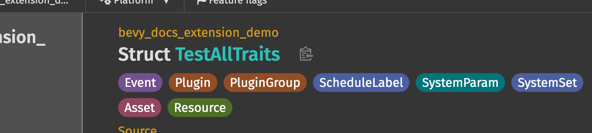
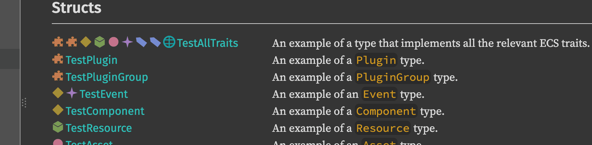

+++
title = "Rustdoc: make notable traits useful"
description = "Javascript in our docs?"
date = 2026-05-23T19:33:19+00:00
updated = 2026-05-23T19:33:19+00:00
draft = false
template = "drafts/page.html"

[extra]
lead = "Let's explore what Bevy has been doing to guide their users to the correct concepts, and how Rustdoc (or you?) can help."
+++

# Discoverability is not my best trait.

## The need (blabla...)

Trait-heavy framework APIs (Bevy, but also Diesel, axum, embedded HALs) have poor discoverability in default rustdoc. From a type page it is hard to answer: *is this a `Component`? a `Resource`?*

Trait impls are listed flatly, far from the type's header, and conceptual grouping of items by trait role does not exist.

Bevy has been experimenting with augmenting rustdoc output to surface these concepts. Let's see what you think!

## Our approach today

- **Trait tags**: badges associated to a type indicating which Bevy traits it implements (`Component`, `Resource`, `Asset`...).
  - Color coded, so it's better to navigate and understand at a glance.
  - See them on a type's page.
    - 
    - See: <https://docs.rs/bevy_docs_extension_demo/latest/bevy_docs_extension_demo/struct.TestAllTraits.html>.
  - See an indication of those when referenced elsewhere
    - 
    - See: <https://docs.rs/bevy_docs_extension_demo/latest/bevy_docs_extension_demo/index.html#structs>.
    - adding emoji is fancy but a simple circle with its color coded would be enough.

### Controversial

- To avoid clutter we filter them out depending on combinations (a `Resource` is also a `Component`, but a user isn't usually interested in knowing that it's a `Component`)
  - In hindsight, it's probably a bad idea to assume user is not interested in details, so I suggest to let this go.
  - See: <https://github.com/bevyengine/bevy/pull/24222>.
- **Trait sections**: module pages group items by trait role instead of one flat list. See <https://github.com/bevyengine/bevy/pull/17821>.

## How it's implemented

The current implementation is **JavaScript shipped from the crate that mutates rustdoc's generated DOM at load time**. It works, but:

- It depends on rustdoc's HTML/CSS structure, which is not a stable interface.
- Shipping JS from a crate to alter rustdoc output is... controversial, and will™️ be forbidden in the future.

## What we ruled out

- Using a `rustdoc` wrapper that postprocesses HTML at build time instead of in the browser was abandoned in favor of the JS approach, because of maintenance burden ; See: <https://github.com/bevyengine/bevy/pull/17857>.

## Rustdoc specifics

Rustdoc's ["Notable traits"](https://doc.rust-lang.org/stable/rustdoc/unstable-features.html#adding-your-trait-to-the-notable-traits-dialog) may be a good concept to hook onto to power this feature.

### How?

I'll detail my understanding on how rustdoc works, but the following may be incorrect or not the correct approach, read it as a discussion starter.

#### Gotta have that data

*If* we choose to hook on to the notable trait API, we already have that info :tada: !

#### Gotta display that data

Rustdoc [queries annotations](https://github.com/rust-lang/rust/pull/102384) (this should probably linked in the above issue) through [attributes](https://github.com/rust-lang/rust/blob/54333ff079780f803f65dcee30c544050b35f544/src/tools/rust-analyzer/crates/hir/src/attrs.rs#L110).

So I expect it to be straightforward to retrieve that information where we have the traits implemented by our type.

For other areas (list of types), there is [get_filtered_impls_for_reference](https://github.com/rust-lang/rust/blob/54333ff079780f803f65dcee30c544050b35f544/src/librustdoc/html/render/mod.rs#L2492) which may be helpful to start an implementation.

So, who's up to implement it?

## Additional context

**Maintenance of the JS approach**
- [#21462](https://github.com/bevyengine/bevy/pull/21462)

Abandoned ideas

- [`Require<C>` marker trait](https://github.com/bevyengine/bevy/pull/18169): abusing trait markers to "tag" components, too noisy.
- [required components section via the wrapper](https://github.com/bevyengine/bevy/pull/18171): rustdoc wrapper was rejected.

